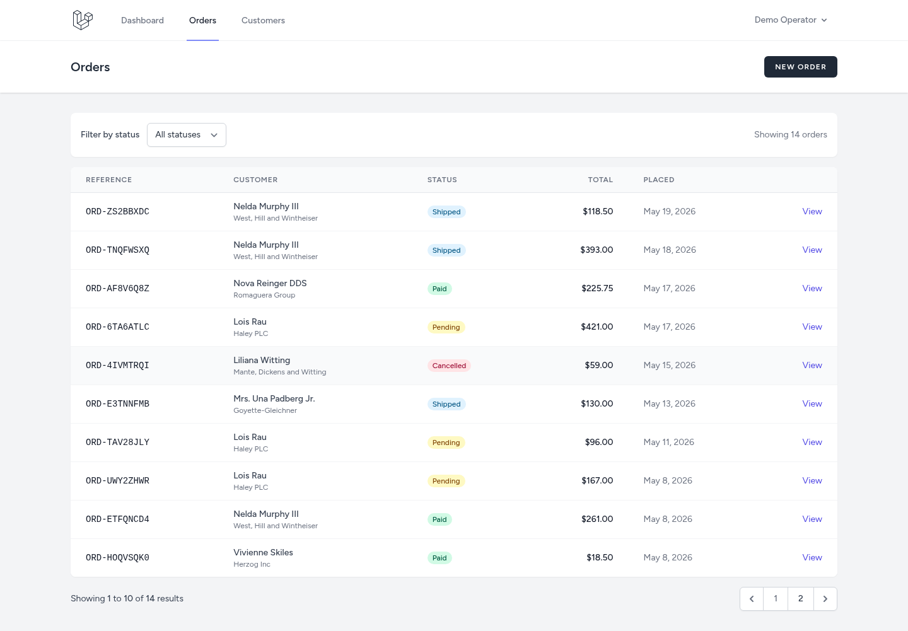
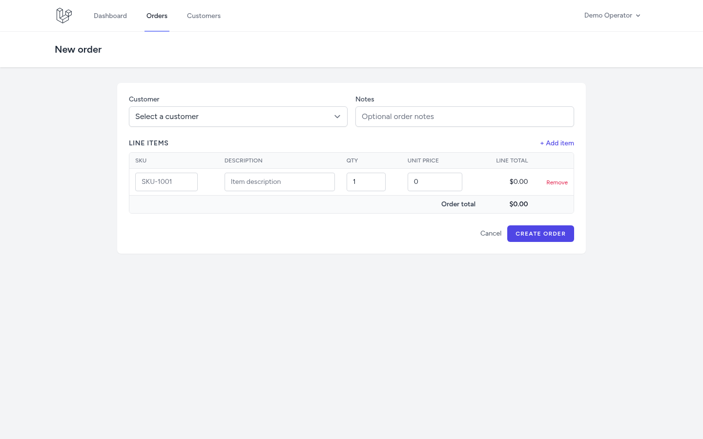
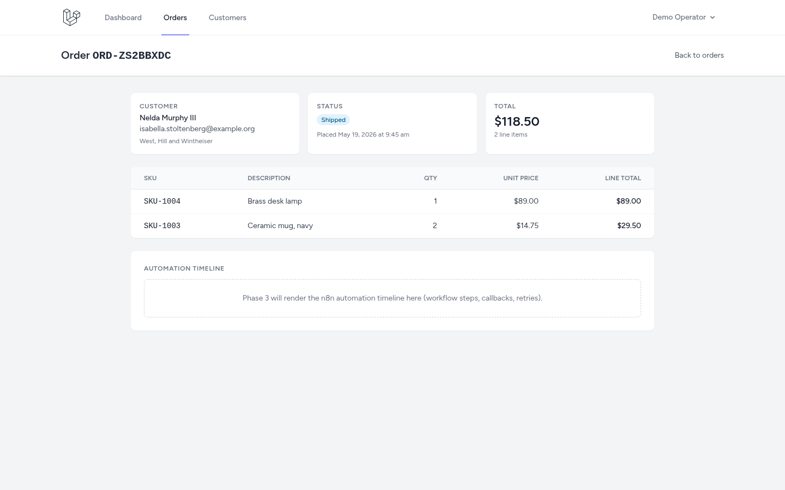
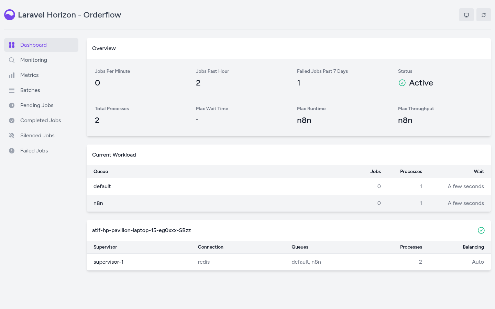
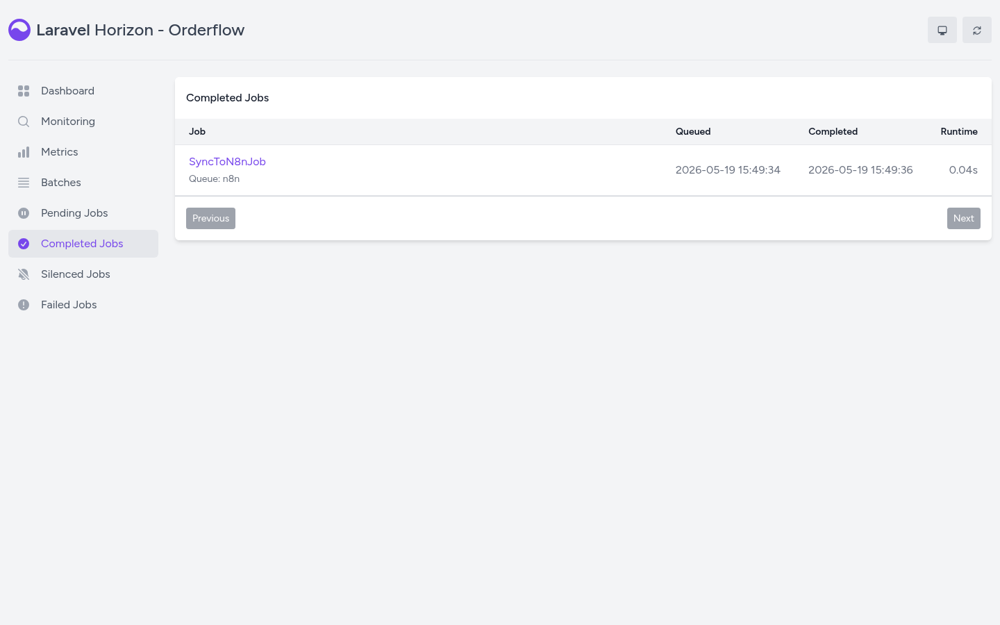
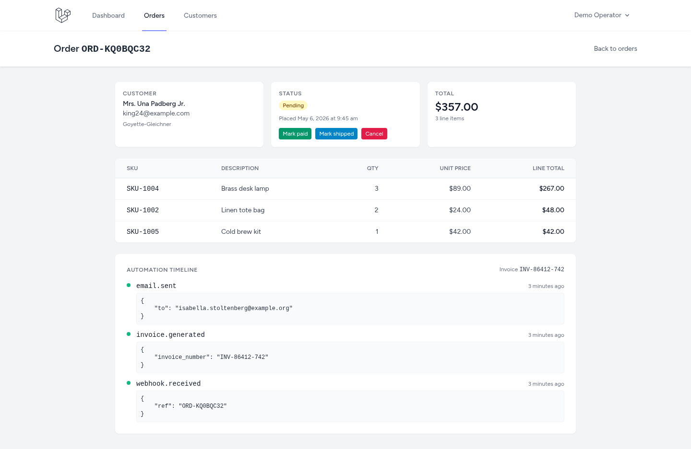

# Orderflow

A small order management application with first-class n8n automation. Place an order in the UI, watch a workflow run multi-step automation (invoicing, notifications, CRM sync), and see the order update itself via callback within seconds.

## Why this exists

Most order tools either run pure manual ops in a CRUD UI or push everything through external SaaS automation that you cannot inspect. Orderflow keeps the order surface inside a Laravel + Livewire app you control, and parks an n8n instance next to it so the automation layer is a workflow JSON you can edit, version, and swap. Every order event fires through n8n; n8n calls back into the app via API. The whole stack runs from a single docker-compose with Laravel, Postgres, Redis, n8n, and Mailpit. No external hosting needed to demo.

## Features

- Livewire 3 order surface: create, list, view, update orders with line items and customers
- Event-driven outbound webhooks to n8n with HMAC signature verification
- Inbound REST API for n8n callbacks, protected by per-workflow API token and idempotency key
- AutomationLog timeline rendered in the Livewire order view so every n8n step is visible
- Demo workflow committed at `n8n/workflows/order-placed.json` so anyone running the stack gets the same flow
- Horizon dashboard for queue monitoring, Mailpit for local mail capture
- Everything boots from one docker-compose

## Demo flow

1. Ops user creates an order in the Livewire UI (customer, line items, total).
2. Laravel dispatches `OrderPlaced`. The queue worker POSTs the payload to the `order-placed` webhook in n8n with an HMAC signature.
3. n8n workflow runs: branch on total (if over $500 send Slack alert), send confirmation email via Mailpit, generate a fake invoice number, POST it back to `/api/orders/{id}/invoice`, log each step at `/api/orders/{id}/automation-log`.
4. The Livewire dashboard shows the invoice number and automation timeline within seconds.

## Phases

- Phase 0 (scaffolded): repo structure, docker-compose stub with five services, memory, README, HANDS-ON, .env.example
- Phase 1 (shipped): Laravel 11 + Breeze (Livewire), Pest, Postgres, Redis, Mailpit wired. Customers / Orders / OrderItems domain. Livewire surfaces for the orders index, create form, and detail view. Demo seeder for fast local data.
- Phase 2 (shipped): outbound integration. Four domain events (OrderPlaced / OrderPaid / OrderShipped / OrderCancelled) fired from the Create form and from status buttons on the Show view. Events queue `SyncToN8nJob` (Horizon, Redis-backed) which POSTs a signed payload to n8n. HMAC uses deeply sorted-key canonical JSON so n8n can verify deterministically. A demo "Log payload" workflow imported into n8n confirms the round trip returns 200.
- Phase 3 (shipped): inbound integration. `/api/orders/{order}` (GET / PATCH) and `/api/orders/{order}/automation-log` (POST) behind two middlewares: `n8n.token` (Bearer + `hash_equals`) and `idempotency` (Redis-backed 24h dedupe with `X-Idempotency-Replay` on cache hits). `AutomationLog` model records every n8n step result; the Order Show view now polls and renders the timeline with payloads. Production workflow JSON committed at `n8n/workflows/order-placed.json`.
- Phase 4: polish. Timeline UI, dashboard cards, recorded demo, screenshots
- Phase 5 (optional): hosting if there is a reason

## Screenshots

Orders index, paginated with status filter:



Create-order form. Pick a customer, add line items, totals recompute live:



Order detail view. Customer, status, totals, line items, status-change buttons (Mark paid / Mark shipped / Cancel) that fire the matching domain event, and a placeholder for the Phase 3 automation timeline:



Horizon supervisor with the `default` and `n8n` queues, supervised in autoscaling mode:



A `SyncToN8nJob` completing on the `n8n` queue after a status change:



Order Show with the live automation timeline. Each card is one `AutomationLog` row written by n8n through `/api/orders/{id}/automation-log`. The invoice number badge in the corner comes from the workflow's `PATCH /api/orders/{id}`. The view polls every 5s so new steps appear without a reload:



## Running it locally (Phase 1)

```bash
# 1. Start the support services (Postgres on host port 5457, Redis 6383, Mailpit 8025).
docker compose -f docker/docker-compose.yml up -d postgres redis mailpit

# 2. PHP deps, JS deps, asset build.
composer install
npm install
npm run build

# 3. Create test database for Pest (one-off).
docker exec orderflow-postgres psql -U orderflow -d postgres -c "CREATE DATABASE orderflow_test;"

# 4. App key + migrate + seed.
cp .env.example .env   # then edit DB_HOST to 127.0.0.1 and DB_PORT to 5457 for host-side use
php artisan key:generate
php artisan migrate --seed

# 5. Serve.
php artisan serve

# 6. Tests.
./vendor/bin/pest
```

Demo login (created by the seeder): `demo@orderflow.local` / `password`.

## Phase 2 round trip (outbound to n8n)

```bash
# 1. Start n8n alongside the support services.
docker compose -f docker/docker-compose.yml up -d n8n

# 2. Start Horizon to consume the n8n queue.
php artisan horizon

# 3. Open the n8n editor at http://localhost:5679 and create a workflow with one
#    Webhook node (POST /webhook/order-placed) that responds 200. Activate it.
#    The repo ships a tinker-importable copy at n8n/workflows/log-payload.json
#    (Phase 3 commits the production order-placed.json).

# 4. Trigger the round trip without touching the UI.
php artisan n8n:test-webhook order.placed

# 5. Or place an order in the UI: http://orderflow.local:8000/orders/create
#    The save also dispatches OrderPlaced. Status buttons on the Show view
#    fire OrderPaid / OrderShipped / OrderCancelled the same way.

# 6. Watch jobs in Horizon at http://orderflow.local:8000/horizon and inbound
#    webhook executions in n8n at http://localhost:5679.
```

Outbound payloads are signed with `HMAC-SHA256` using a stable, deeply
sorted-key JSON serialisation so n8n can verify without any whitespace
or ordering ambiguity. Headers: `X-Orderflow-Event`, `X-Orderflow-Signature`.

## Phase 3 inbound API

n8n calls back into Laravel at three endpoints, all under `/api/orders/`:

| Method | Path | Purpose |
| ------ | ---- | ------- |
| GET    | `/api/orders/{order}` | Read current state of one order |
| PATCH  | `/api/orders/{order}` | Set `status`, `invoice_number`, `external_id` |
| POST   | `/api/orders/{order}/automation-log` | Append a timeline entry |

Every request must carry `Authorization: Bearer <N8N_API_TOKEN>` (checked
with `hash_equals` in `VerifyN8nApiToken` middleware). Writes additionally
require an `Idempotency-Key` header; the response is cached in Redis with
a 24h TTL, and a second hit returns the same status + body with
`X-Idempotency-Replay: true`.

Import the production workflow once into your local n8n:

```bash
docker cp n8n/workflows/order-placed.json orderflow-n8n:/tmp/order-placed.json
docker exec orderflow-n8n n8n import:workflow --input=/tmp/order-placed.json
# Then open http://localhost:5679, finish n8n owner setup if prompted,
# activate the "Order placed" workflow with the toggle in the top-right.
```

After that, `php artisan n8n:test-webhook order.placed` (or saving any
order in the UI) drives the full round trip: Laravel POSTs the signed
payload, the workflow logs `webhook.received`, generates a fake invoice
number, PATCHes the order with it, and logs `invoice.generated`. The
Order Show view polls every 5s so the timeline fills in live.
